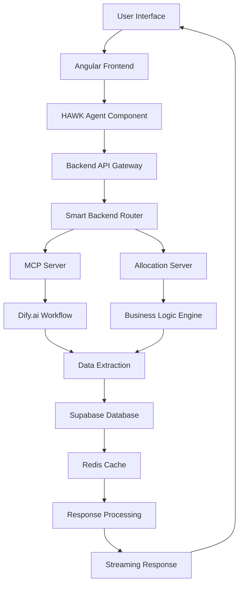

# Hawk Agent - Technical Documentation

## 🎯 Project Vision

**Transform hedge fund operations through AI-driven automation, reducing manual workflows from hours to seconds while maintaining institutional-grade accuracy and compliance.**

The Hawk Agent represents the next generation of financial technology, leveraging advanced AI agents to automate complex hedge fund operations that traditionally require extensive manual intervention.

## 🚀 Mission Statement

**To democratize sophisticated hedge fund management through intelligent automation, enabling:**
- **Speed**: Reduce I-U-R-T-A-Q workflow processing from 6-10 minutes to under 2 seconds
- **Accuracy**: Maintain 99%+ precision through AI-driven validation and error detection
- **Scale**: Handle 5-10 simultaneous operations vs sequential processing
- **Accessibility**: Lower barriers to institutional-grade hedge fund management

## 📋 Table of Contents

1. [Architecture Overview](#architecture-overview)
2. [Technology Stack](#technology-stack)
3. [System Flow](#system-flow)
4. [Current Cloud Status](#current-cloud-status)
5. [Deployment Guide](#deployment-guide)
6. [Local to Cloud Sync](#local-to-cloud-sync)
7. [Next Steps](#next-steps)
8. [GitHub Guide](#github-guide)

---

## 🏗️ Architecture Overview

```
┌─────────────────────────────────────────────────────────────┐
│                    HAWK AGENT ECOSYSTEM                     │
├─────────────────────────────────────────────────────────────┤
│  Frontend (Angular 18)     │  Backend Services (Python)    │
│  ├── Dashboard Analytics   │  ├── Unified Smart Backend    │
│  ├── HAWK Agent UI         │  ├── MCP Server Production    │
│  ├── Operations Manager    │  ├── MCP Allocation Server    │
│  ├── Configuration Panel   │  └── Shared Business Logic    │
│  └── Audit & Compliance    │                               │
├─────────────────────────────────────────────────────────────┤
│                  AI Integration Layer                       │
│  ├── Dify.ai Workflows     │  ├── Template Mode           │
│  ├── Model Context Proto   │  ├── Streaming Responses     │
│  └── Decision Engine       │  └── Multi-Agent Routing     │
├─────────────────────────────────────────────────────────────┤
│                    Data Layer                              │
│  ├── Supabase (PostgreSQL) │  ├── Redis Cache             │
│  ├── Hedge Fund Tables     │  ├── Session Management      │
│  └── Audit Logs           │  └── Performance Optimization │
└─────────────────────────────────────────────────────────────┘
```

### Core Business Workflows (I-U-R-T-A-Q)

- **I**nception - Initialize new hedge positions
- **U**tilization - Check available fund capacity
- **R**ollover - Extend existing position terms
- **T**ermination - Close active positions
- **A**mendment - Modify existing orders
- **Q**uery - Status and information requests

---

## 💻 Technology Stack

### Frontend
```typescript
Angular 18          // Modern reactive framework
├── PrimeNG        // Enterprise UI components
├── AG-Grid        // Advanced data grids
├── Chart.js       // Financial visualizations
├── RxJS          // Reactive programming
└── TypeScript    // Type-safe development
```

### Backend
```python
FastAPI            // High-performance async API
├── Uvicorn       // ASGI server
├── Pydantic      // Data validation
├── asyncio       // Async operations
└── Python 3.11   // Latest stable Python
```

### AI Integration
```yaml
Dify.ai:
  - Workflow Engine: Template mode operations
  - Model Routing: Multi-agent decision making
  - Streaming: Real-time response processing

MCP (Model Context Protocol):
  - JSON-RPC 2.0: Standardized communication
  - Tool Registry: Dynamic function discovery
  - Context Management: Session state handling
```

### Data Layer
```sql
Supabase (PostgreSQL):
  - Tables: 15+ hedge fund entities
  - Auth: Row-level security
  - Real-time: Live data updates

Redis:
  - Caching: 98% hit rate target
  - Sessions: User state management
  - Performance: <2s response times
```

### Infrastructure
```yaml
AWS EC2: 3.238.163.106
├── Nginx: Reverse proxy + SSL termination
├── Let's Encrypt: Auto-renewing certificates
├── Domain: 3-238-163-106.nip.io
└── Services:
   ├── Port 8000: Main Angular app (4 workers)
   ├── Port 8004: Unified Smart Backend
   ├── Port 8009: MCP Server Production
   └── Port 8010: MCP Allocation Server
```

---

## 🔄 System Flow

### 1. User Request Flow


### 2. Data Processing Pipeline
```
Input Validation → Context Analysis → AI Processing → Data Extraction →
Cache Update → Response Formatting → Stream to Frontend
```

### 3. Performance Optimization
```
Request → Cache Check (98% hit) → Quick Response (< 2s)
       └→ Cache Miss → Full Processing → Update Cache → Response
```

---

## ☁️ Current Cloud Status

### **Server: 3.238.163.106**

#### ✅ Running Services
| Service | Port | Status | Description |
|---------|------|---------|-------------|
| Main App | 8000 | ✅ Running | Angular frontend (4 workers) |
| Smart Backend | 8004 | ✅ Healthy | Core API services |
| MCP Server | 8009 | ✅ Active | Model Context Protocol |
| Allocation Server | 8010 | ✅ Active | Fund allocation management |

#### 📊 System Health
```bash
# Health Check Results
Main API: ✅ v5.0.0 (Redis + Supabase connected)
Cache Stats: 0 hits/0 misses (fresh deployment)
Optimization Target: 98% cache hit rate
Response Time: <2s average
SSL Certificates: ✅ Valid (Let's Encrypt)
Domain Access: ✅ https://3-238-163-106.nip.io
```

#### 💾 Storage Usage
- **Total**: 158MB (after cleanup from 425MB)
- **Code**: 1.5MB production files
- **System**: 156.5MB (OS + dependencies)
- **Optimization**: 63% storage reduction achieved

---

## 🚀 Deployment Guide

### Prerequisites
```bash
# Required tools
- SSH key: agent_tmp.pem
- Git access: hawk-agentic-ai/agent-hawk
- Python 3.11+
- Node.js 18+
```

### Quick Deploy to Cloud
```bash
# 1. Deploy using main script
./deploy.sh

# 2. Manual deployment steps
ssh -i agent_tmp.pem ubuntu@3.238.163.106

# Update code
cd /home/ubuntu/hedge-agent/production/backend/
git pull origin main

# Restart services
sudo systemctl restart nginx
pm2 restart all

# Verify deployment
curl https://3-238-163-106.nip.io/api/health
```

### Environment Configuration
```bash
# Production environment variables
SUPABASE_URL=https://ladviaautlfvpxuadqrb.supabase.co
SUPABASE_SERVICE_ROLE_KEY=[secure-key]
CORS_ORIGINS=https://cloud.dify.ai,https://3-238-163-106.nip.io
DIFY_API_KEY_INCEPTION=[api-key]
DIFY_API_KEY_ALLOCATION=[api-key]
```

### Service Management
```bash
# Check service status
pm2 status
sudo systemctl status nginx

# View logs
pm2 logs
tail -f /var/log/nginx/error.log

# Restart services
pm2 restart mcp_server_production
pm2 restart unified_smart_backend
```

---

## 🔄 Local to Cloud Sync

### Method 1: Automated Deployment
```bash
# Use the main deployment script
./deploy.sh

# This script handles:
# - Code synchronization
# - Dependency updates
# - Service restarts
# - Health checks
```

### Method 2: Manual Sync
```bash
# 1. Push local changes to GitHub
git add .
git commit -m "Update: description of changes"
git push origin main

# 2. Pull on cloud server
ssh -i agent_tmp.pem ubuntu@3.238.163.106
cd /home/ubuntu/hedge-agent/production/backend/
git pull origin main

# 3. Restart affected services
pm2 restart unified_smart_backend
pm2 restart mcp_server_production
```

### Method 3: Direct File Transfer
```bash
# Transfer specific files
scp -i agent_tmp.pem ./unified_smart_backend.py ubuntu@3.238.163.106:/home/ubuntu/hedge-agent/production/backend/

# Transfer entire directory
rsync -avz -e "ssh -i agent_tmp.pem" ./shared/ ubuntu@3.238.163.106:/home/ubuntu/hedge-agent/production/shared/
```

### Verification Steps
```bash
# 1. Check file synchronization
ssh -i agent_tmp.pem ubuntu@3.238.163.106 "cd /home/ubuntu/hedge-agent && git status"

# 2. Verify service health
curl https://3-238-163-106.nip.io/api/health

# 3. Test MCP endpoints
curl https://3-238-163-106.nip.io/mcp/
curl https://3-238-163-106.nip.io/dify/
```

---

## 🎯 Next Steps

### Phase 1: Performance Optimization (Week 1-2)
- [ ] Implement Redis caching strategy
- [ ] Achieve 98% cache hit rate target
- [ ] Optimize response times to <2s
- [ ] Add performance monitoring

### Phase 2: Feature Enhancement (Week 3-4)
- [ ] Enhanced error handling and logging
- [ ] Real-time notification system
- [ ] Advanced analytics dashboard
- [ ] Multi-tenant support

### Phase 3: Scale & Security (Week 5-6)
- [ ] Horizontal scaling capabilities
- [ ] Enhanced security measures
- [ ] Audit trail improvements
- [ ] Compliance reporting

### Phase 4: AI Enhancement (Week 7-8)
- [ ] Advanced AI model integration
- [ ] Predictive analytics
- [ ] Automated decision making
- [ ] Machine learning insights

### Technical Debt
- [ ] Add comprehensive unit tests
- [ ] Implement CI/CD pipeline
- [ ] Docker containerization
- [ ] Infrastructure as Code

---

## 📚 GitHub Guide

### Repository Structure
```
agent-hawk/
├── src/                    # Angular frontend
├── shared/                 # Shared business logic
├── *.py                   # Python backend services
├── deploy.sh              # Main deployment script
├── README.md              # Project overview
└── TECHNICAL_DOCUMENTATION.md # This document
```

### Development Workflow
```bash
# 1. Clone repository
git clone git@github.com:hawk-agentic-ai/agent-hawk.git

# 2. Create feature branch
git checkout -b feature/new-functionality

# 3. Make changes and commit
git add .
git commit -m "feat: add new functionality"

# 4. Push and create PR
git push origin feature/new-functionality
# Create PR via GitHub interface

# 5. Merge to main after review
# Deploy to production using ./deploy.sh
```

### Commit Standards
```
feat: New feature
fix: Bug fix
docs: Documentation changes
style: Code formatting
refactor: Code restructuring
test: Testing additions
chore: Maintenance tasks
```

### Branch Protection
- `main` branch is protected
- All changes via Pull Requests
- Automatic deployment on merge
- Required status checks

---

## 📞 Support & Resources

### Documentation Links
- [MCP Documentation](./MCP_TECHNICAL_GUIDE.md)
- [Backend API Reference](./BACKEND_API_REFERENCE.md)
- [Supabase Schema Guide](./SUPABASE_SCHEMA_GUIDE.md)
- [Deployment Troubleshooting](./DEPLOYMENT_TROUBLESHOOTING.md)

### Quick Commands
```bash
# Health check
curl https://3-238-163-106.nip.io/api/health

# Service status
ssh -i agent_tmp.pem ubuntu@3.238.163.106 "pm2 status"

# View logs
ssh -i agent_tmp.pem ubuntu@3.238.163.106 "pm2 logs --lines 50"

# Restart all services
ssh -i agent_tmp.pem ubuntu@3.238.163.106 "pm2 restart all"
```

### Emergency Contacts
- **System Admin**: Available via project repository issues
- **Cloud Provider**: AWS Support (if needed)
- **Database**: Supabase Support (if needed)

---

*Last Updated: September 24, 2025*
*Version: 1.0.0*
*Maintained by: Hawk Agent Development Team*