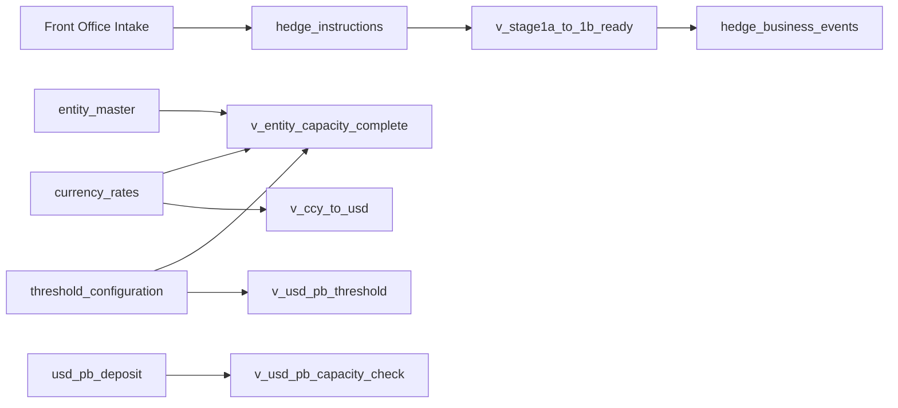
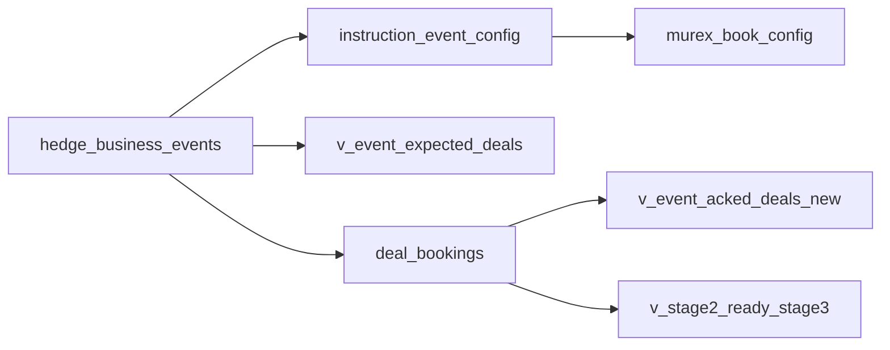
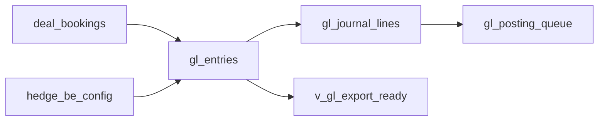
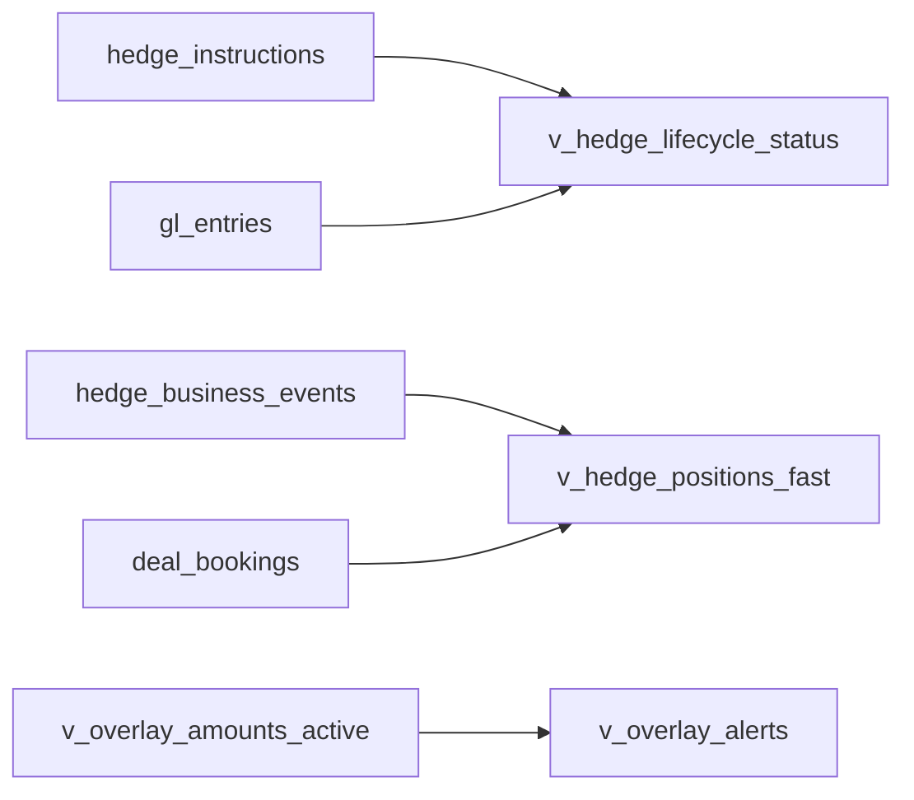
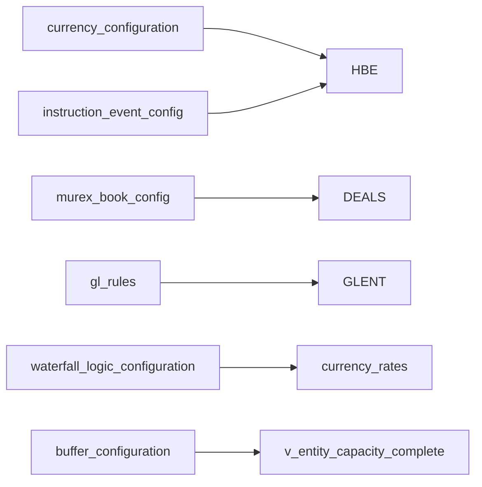
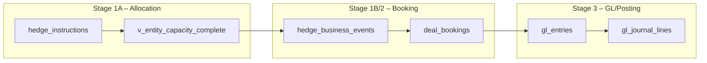

# HAWK Supabase Reference Guide — Agent‑Focused (v1.0)

*Generated:* 2025-09-15 01:00 (Asia/Singapore)

This guide consolidates **all 78 public objects** (tables & views) relevant to the HAWK FX Hedge Processing lifecycle. It is organized by **agent** (Allocation, Booking, GL/Posting, Analytics, Configuration) with:

- Tables & Views Index (importance **P0–P2**)
- Per-table **cards** (purpose, compact columns, typical usage, lineage, why it matters)
- **Example prompts → example queries** (task-driven)
- Agent **lineage maps** (Mermaid) and a **cross-stage** overview
- **Regeneration & versioning** steps (to auto-refresh from Supabase)

## Tables & Views Index (by Agent)

## Allocation Agent — Tables & Views Index
| Table | Type | Importance | Stage |
|---|---|---|---|
| currency_rate_pairs | Base | P1 | Stage 1A |
| currency_rates | Base | P0 | Stage 1A |
| entity_master | Base | P0 | Stage 1A |
| hedge_instructions | Base | P0 | Stage 1A |
| rate_history | Base | P1 | Stage 1A |
| rate_staging | Base | P1 | Stage 1A |
| threshold_configuration | Base | P0 | Stage 1A |
| usd_pb_deposit | Base | P1 | Stage 1A |
| v_allocation_waterfall_summary | View | P2 | Stage 1A |
| v_available_amounts_fast | View | P2 | Stage 1A |
| v_available_amounts_test | View | P2 | Stage 1A |
| v_ccy_to_usd | View | P0 | Stage 1A |
| v_entity_capacity_complete | View | P0 | Stage 1A |
| v_stage1a_overlay_lookup | View | P0 | Stage 1A |
| v_stage1a_to_1b_ready | View | P0 | Stage 1A |
| v_usd_pb_capacity_check | View | P0 | Stage 1A |
| v_usd_pb_threshold | View | P0 | Stage 1A |

## Booking Agent — Tables & Views Index
| Table | Type | Importance | Stage |
|---|---|---|---|
| allocation_engine | Base | P0 | Stage 1B/2 |
| deal_bookings | Base | P0 | Stage 2 |
| deal_bookings_archive | Base | P1 | Stage 2 |
| h_stg_mrx_ext | Base | P1 | Stage 2 |
| hedge_business_events | Base | P0 | Stage 1B/2 |
| instruction_event_config | Base | P0 | Stage 2 |
| murex_book_config | Base | P0 | Stage 2 |
| mx_discounted_spot | Base | P1 | Stage 2 |
| mx_proxy_hedge_report | Base | P1 | Stage 2 |
| trade_history | Base | P2 | Stage 2 |
| v_event_acked_deals | View | P1 | Stage 2 |
| v_event_acked_deals_new | View | P0 | Stage 2 |
| v_event_expected_deals | View | P0 | Stage 2 |
| v_hstg_inbound_pending | View | P1 | Stage 2 |
| v_hstg_outbound_queue | View | P1 | Stage 2 |
| v_stage2_ready_stage3 | View | P0 | Stage 2 |
| v_stage2_stuck | View | P2 | Stage 2 |

## GL/Posting Agent — Tables & Views Index
| Table | Type | Importance | Stage |
|---|---|---|---|
| gl_coa | Base | P1 | Stage 3 |
| gl_entries | Base | P0 | Stage 3 |
| gl_entries_archive | Base | P1 | Stage 3 |
| gl_entries_detail | Base | P1 | Stage 3 |
| gl_journal_lines | Base | P0 | Stage 3 |
| gl_periods | Base | P1 | Stage 3 |
| gl_posting_queue | Base | P0 | Stage 3 |
| gl_rules | Base | P1 | Stage 3 |
| hedge_be_config | Base | P0 | Stage 3 |
| v_gl_export_ready | View | P0 | Stage 3 |

## Analytics Agent — Tables & Views Index
| Table | Type | Importance | Stage |
|---|---|---|---|
| audit_trail | Base | P1 | Cross-stage |
| hawk_agent_attachments | Base | P2 | Cross-stage |
| hawk_agent_conversations | Base | P2 | Cross-stage |
| hawk_agent_errors | Base | P1 | Cross-stage |
| hawk_agent_sessions | Base | P2 | Cross-stage |
| hawk_hbe_instruction_mismatch | Base | P2 | Cross-stage |
| v_hedge_instructions_fast | View | P2 | Cross-stage |
| v_hedge_lifecycle_status | View | P1 | Cross-stage |
| v_hedge_positions_fast | View | P1 | Cross-stage |
| v_overlay_alerts | View | P1 | Cross-stage |
| v_overlay_amounts_active | View | P1 | Cross-stage |

## Configuration Agent — Tables & Views Index
| Table | Type | Importance | Stage |
|---|---|---|---|
| buffer_configuration | Base | P2 | Cross-stage |
| capacity_overrides | Base | P2 | Cross-stage |
| car_master | Base | P2 | Cross-stage |
| car_parameters | Base | P2 | Cross-stage |
| car_thresholds | Base | P2 | Cross-stage |
| currency_configuration | Base | P0 | Cross-stage |
| entity_threshold_configuration | Base | P2 | Cross-stage |
| stage_bundles | Base | P2 | Cross-stage |
| system_configuration | Base | P2 | Cross-stage |
| waterfall_logic_configuration | Base | P2 | Cross-stage |

## Agent Lineage Maps

### Allocation (Stage 1A)


### Booking (Stage 1B/2)


### GL/Posting (Stage 3)


### Analytics (Cross-stage)


### Configuration (Cross-stage)


## Cross‑Stage Map (1A → 2 → 3)


## Per‑Table Cards

### allocation_engine  
*Type:* **Base** • *Importance:* **P0** • *Agent:* **Booking** • *Stage:* **Stage 1B/2**
**Purpose:** Stage‑1B allocation computations (capacity split, routing, headroom) per entity/currency.
**Columns (compact):** allocation_id, request_id, entity_id, instruction_id, event_id, currency_code, nav_type, status
**Typical usage:** Reads normalized events/configs and writes bookings; used to validate completeness and route to GL.
**Data lineage:** Upstream: 1A capacity/threshold views → This → hedge_business_events (routed) / deal_bookings (plan)
**Why it matters:** Determines what gets booked, how it’s routed, and whether booking completeness is met.
**Example**  
*Prompt:* “Show expected vs booked deals for EVT123.”  
*Query (sketch):*
```sql
select e.event_id, x.expected_deal_count, a.booked_deal_count
from v_event_expected_deals x
join v_event_acked_deals_new a using(event_id)
where e.event_id = 'EVT123';
```

---

### audit_trail  
*Type:* **Base** • *Importance:* **P1** • *Agent:* **Analytics** • *Stage:* **Cross-stage**
**Purpose:** Operational audit trail of messages and state transitions.
**Columns (compact):** audit_id, trace_id, transaction_id, record_id, msg_uid, stage, process_step, status
**Typical usage:** Read‑only consumption for dashboards, KPIs, throughput, and exception monitoring.
**Data lineage:** See agent lineage map; object participates in standard stage flow.
**Why it matters:** Enables visibility and control—KPIs, alerts, and lifecycle tracking for the entire pipeline.
**Example**  
*Prompt:* “What’s the end‑to‑end status and aging for instruction HI999?”  
*Query (sketch):*
```sql
select * from v_hedge_lifecycle_status where instruction_id = 'HI999';
```

---

""" + cards_md.split('---

', 3)[3] + "

---

## Regeneration & Versioning

**Goal:** keep this guide in lockstep with Supabase schema & ops semantics.

### 1) Schema introspection (Supabase → information_schema)
```sql
-- Objects
select table_name, table_type
from information_schema.tables
where table_schema = 'public'
order by table_name;

-- Columns
select table_name, column_name, data_type, is_nullable, column_default, ordinal_position
from information_schema.columns
where table_schema = 'public'
order by table_name, ordinal_position;

-- Foreign Keys
select tc.table_name, kcu.column_name, ccu.table_name as foreign_table, ccu.column_name as foreign_column
from information_schema.table_constraints tc
join information_schema.key_column_usage kcu
  on tc.constraint_name = kcu.constraint_name and tc.table_schema = kcu.table_schema
join information_schema.constraint_column_usage ccu
  on ccu.constraint_name = tc.constraint_name and ccu.table_schema = tc.table_schema
where tc.constraint_type = 'FOREIGN KEY' and tc.table_schema = 'public'
order by 1,2;
```

### 2) Semantics overlay (YAML in repo)
```yaml
tables:
  hedge_instructions:
    importance: P0
    purpose: Stores front-office hedge instructions; seeds Stage-1A checks.
    agent: Allocation
    stage: Stage 1A
  hedge_business_events:
    importance: P0
    purpose: Normalized, approved events; input to booking.
    agent: Booking
    stage: Stage 1B/2
# ...
```

### 3) Generator script (Node/Python)
- Parse information_schema dump
- Merge YAML semantics
- Render this markdown (sections: indices, cards, diagrams)

### 4) CI automation (GitHub Actions)
```yaml
name: regen-supabase-reference
on:
  schedule: [{ cron: "0 17 * * *" }]  # 1am SGT daily
  workflow_dispatch:
jobs:
  build:
    runs-on: ubuntu-latest
    steps:
      - uses: actions/checkout@v4
      - uses: actions/setup-python@v5
        with: { python-version: "3.11" }
      - run: pip install jinja2 pyyaml
      - run: python scripts/generate_reference.py > SUPABASE_TABLES_REFERENCE.md
      - run: git config user.name "HAWK Bot"; git config user.email "hawk-bot@example.com"
      - run: git add SUPABASE_TABLES_REFERENCE.md && git commit -m "auto: refresh reference" || echo "No changes"
      - run: git push
```

### 5) KB sync (LlamaCloud)
- Upload/overwrite `SUPABASE_TABLES_REFERENCE.md` in the HAWK KB set (hawk-master/hawk-ref)
- Point Dify agents to this single canonical doc in their retrieval chain

---

## Appendix — Glossary

" + glossary_md}]}

